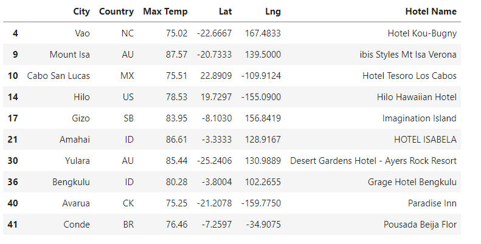
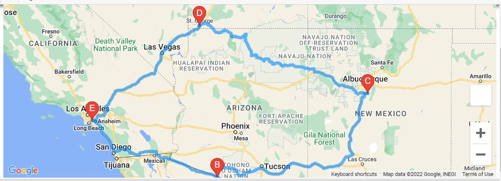

# World Weather Analysis

## Project Overview

PlanMyTrip is a top travel technology company which specializes in internet related services in the hotel and lodging industry. Jack, the head of analysis for the user interface team, has asked me to help him collect and present for PlanMyTrip’s search page. This will ameliorate the platform and provide real-time suggestions for the customers’ ideal hotels. After collecting and analyzing weather data across cities throughout the world, I incorporated the data for customers’ usage via PlanMyTrip’s search page. Our customers will use this collected data and filter though the presented recommendations to find their ideal hotel anywhere in the world. based on our clients’ weather preferences.

## Resources

- Data Sources: https://openweathermap.org/api, https://developers.google.com/maps/documentation/directions 
- Software: Anaconda, Python, Jupiter Notebook, Pandas, Matplotlib, NumPy, CityPy, Python Request, APIs, JSON

## Results

Snapshot of data collection results:

Snapshot of hotel data provided to clients as the search through the options we provide:

Snapshot of clients’ travel directions:

## Summary

Performing a statistical analysis using linear regression on weather parameters for the northern and southern hemisphere helped PlanMyTrip predict the best time of year for our clients to plan their vacations. By inclining our customers to search through our data and filtering it with their weather preferences, we exceed their expectations of seamlessly making travel plans for ideal vacation. In addition, we will increase our revenue by using the data collected to introduce tailored advertising, products, services, and offers to our valued customers.
